<div align="center">
  
  
  # MarkZen
  
  **🚀 A Lightning-Fast, Lightweight Markdown Editor**
  
  *Inspired by Typora, Built with Modern Technologies*
  
  [](https://github.com/yourusername/markzen/releases)
  [](LICENSE)
  [](#installation)
  [](https://tauri.app/)
  [](https://react.dev/)
  
  [📥 Download](#installation) • [🎯 Features](#features) • [🛠️ Development](#development) • [📖 Documentation](#documentation)
</div>

---

## ✨ Features

### 🚀 **Performance First**
- **⚡ Lightning Startup**: < 1 second boot time
- **📊 Memory Efficient**: < 100MB RAM usage (idle)
- **📁 Large Files**: Smooth editing of 100MB+ documents
- **🔄 Real-time Preview**: < 50ms rendering delay
- **📦 Tiny Bundle**: < 15MB installer size

### 🎨 **Modern Design**
- **✨ Glass Morphism**: Beautiful frosted glass UI
- **🌓 Multi-themes**: Paper White, Midnight, True Black
- **📱 Responsive**: Adaptive layout for all screen sizes
- **🧘 Focus Mode**: Distraction-free writing experience
- **⌨️ Typewriter Mode**: Enhanced writing flow

### 📝 **Rich Editing**
- **🔍 Live Preview**: Seamless real-time rendering
- **🔀 View Modes**: Source / Preview / Split views
- **📑 Table of Contents**: Auto-generated outline
- **🧮 Math Support**: LaTeX formulas with KaTeX
- **📊 Diagrams**: Mermaid charts integration
- **🎯 Syntax Highlighting**: Full Markdown support

### 🛠️ **Developer Friendly**
- **🏗️ Modern Stack**: Tauri v2 + React 19 + TypeScript
- **🔧 Extensible**: Plugin-ready architecture
- **💾 Auto-save**: Never lose your work
- **📤 Export Options**: PDF, HTML, Word formats
- **🔗 Cross-platform**: Windows, macOS, Linux

## 🎯 Why MarkZen?

| Feature | MarkZen | Typora | Other Editors |
|---------|---------|--------|--------------|
| **Startup Time** | < 1s | ~3s | 2-5s |
| **Memory Usage** | < 100MB | ~200MB | 150-500MB |
| **Bundle Size** | < 15MB | ~100MB | 50-200MB |
| **Large Files** | ✅ 100MB+ | ⚠️ Slow | ❌ Crash |
| **Modern UI** | ✅ Glass | ⚠️ Basic | ✅ Varies |
| **Open Source** | ✅ MIT | ❌ Paid | ✅ Varies |

## 🚀 Installation

### 📥 Download Releases

**Latest Release: v0.1.0**

- 🪟 **Windows**: `MarkZen-0.1.0-windows.msi`
- 🍎 **macOS**: `MarkZen-0.1.0-macos.dmg`
- 🐧 **Linux**: `MarkZen-0.1.0-linux.deb` / `MarkZen-0.1.0-linux.AppImage`

### 🛠️ Build from Source

```bash
# Prerequisites
# - Node.js 18+
# - Rust 1.70+
# - Tauri CLI

# Clone repository
git clone https://github.com/yourusername/markzen.git
cd markzen

# Install dependencies
npm install

# Development mode
npm run tauri dev

# Build for production
npm run tauri build
```

## 🏗️ Tech Stack

**Modern Architecture for Maximum Performance**

```mermaid
graph TB
    A["🎨 React 19 Frontend"] --> B["🔗 Tauri v2 Bridge"]
    B --> C["⚡ Rust Backend"]
    D["📝 CodeMirror 6"] --> A
    E["🔄 unified/remark"] --> A
    F["🎨 Tailwind CSS"] --> A
    G["📊 Zustand State"] --> A
    
    style A fill:#61dafb
    style B fill:#ffc131
    style C fill:#dea584
    style D fill:#1f2937
    style E fill:#10b981
    style F fill:#06b6d4
    style G fill:#f59e0b
```



### 🔧 **Core Technologies**
- **Frontend**: React 19 + React Compiler + TypeScript
- **Backend**: Rust + Tauri v2 APIs
- **Editor**: CodeMirror 6 (virtual scrolling)
- **Parser**: unified/remark/rehype pipeline
- **Styling**: Tailwind CSS + Sass
- **State**: Zustand (lightweight)
- **Build**: Vite + TypeScript

### ⚡ **Performance Optimizations**
- **React 19 Compiler**: Auto-optimization, zero manual memoization
- **Rust Backend**: Native-speed file operations
- **Virtual Scrolling**: Handle massive documents
- **Incremental Parsing**: Only re-render changed content
- **Memory Management**: Efficient garbage collection

## 🎨 Screenshots

<div align="center">
  
### 📝 **Split View Mode**


### 🧘 **Focus Mode**


### 🌙 **Dark Theme**


</div>

## 🛠️ Development

### 📋 **Prerequisites**

```bash
# Install Node.js (18+)
node --version  # v18.0.0+

# Install Rust (1.70+)
rustc --version  # 1.70.0+

# Install Tauri CLI
npm install -g @tauri-apps/cli
```

### 🏃 **Quick Start**

```bash
# 1. Clone the repository
git clone https://github.com/yourusername/markzen.git
cd markzen

# 2. Install dependencies
npm install

# 3. Start development server
npm run tauri dev

# 4. Build for production
npm run tauri build
```

### 📁 **Project Structure**

```
markzen/
├── src/                    # React frontend
│   ├── components/         # UI components
│   ├── stores/            # Zustand state
│   ├── styles/            # Sass stylesheets
│   └── utils/             # Helper functions
├── src-tauri/             # Rust backend
│   ├── src/               # Rust source code
│   ├── icons/             # App icons
│   └── Cargo.toml         # Rust dependencies
├── public/                # Static assets
└── dist/                  # Build output
```

### 🧪 **Available Scripts**

```bash
npm run dev          # Start Vite dev server
npm run build        # Build frontend
npm run preview      # Preview build
npm run tauri dev    # Start Tauri development
npm run tauri build  # Build Tauri app
```

## 🗺️ Roadmap

### 🎯 **Current Version (v0.1.0)**
- ✅ Core editor functionality
- ✅ Real-time preview
- ✅ Basic theme system
- ✅ File operations
- ✅ Math & diagram support

### 🚀 **v0.2.0 - Enhanced Features**
- 🔄 Plugin system
- 📁 Advanced file management
- 🎨 Theme customization
- 📤 Enhanced export options
- 🔍 Global search

### 🌟 **v0.3.0 - Pro Features**
- ☁️ Cloud sync
- 👥 Collaboration
- 📊 Advanced analytics
- 🔌 External integrations
- 📱 Mobile companion

### 🎉 **v1.0.0 - Stable Release**
- 🛡️ Security audit
- 📚 Complete documentation
- 🧪 Comprehensive testing
- 🌍 Internationalization
- 💎 Performance optimization

## 🤝 Contributing

We welcome contributions! Please see our [Contributing Guide](CONTRIBUTING.md) for details.

### 🐛 **Bug Reports**
Found a bug? [Open an issue](https://github.com/yourusername/markzen/issues/new?template=bug_report.md)

### 💡 **Feature Requests**
Have an idea? [Request a feature](https://github.com/yourusername/markzen/issues/new?template=feature_request.md)

### 🔧 **Development**
1. Fork the repository
2. Create your feature branch (`git checkout -b feature/amazing-feature`)
3. Commit your changes (`git commit -m 'Add amazing feature'`)
4. Push to the branch (`git push origin feature/amazing-feature`)
5. Open a Pull Request

## 📄 License

This project is licensed under the MIT License - see the [LICENSE](LICENSE) file for details.

## 🙏 Acknowledgments

- **Inspiration**: [Typora](https://typora.io/) for the excellent UX design
- **Framework**: [Tauri](https://tauri.app/) for the amazing desktop framework
- **Editor**: [CodeMirror](https://codemirror.net/) for the powerful editor
- **Parser**: [unified](https://unifiedjs.com/) for the markdown processing
- **Icons**: Custom designed logo and interface icons

## 🌟 Star History

[](https://star-history.com/#yourusername/markzen&Date)

---

<div align="center">
  
**Made with ❤️ for the Markdown community**

[⬆️ Back to Top](#markzen)

</div>